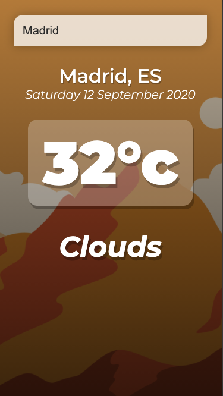
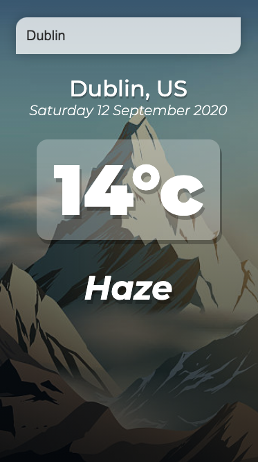

# Vanilla JS Weather APP ☀️

The goal of this assignment is to build a vanilla JavaScript weather app.

Use the provided markup as a guide.

## Aceptance Criteria

```
As a user I want to see the weather in different cities.

Your objective is to add functionality to the app.

1. I type the name of the desired city.

2. I press Enter (I submit the form).

3. The desired temperature is shown to the screen.
```

Check the live demo here: [live demo](https://vanilla-js-weather-app-codewithdragos.netlify.app/).




## Hints

1. You need to get an api key from https://openweathermap.org/api .
2. Create an account and get your api key.
3. Create a function that will listen to the users key press and fetches the weater if the user presses the "Enter" key.
4. Once the data is fetched, make the necesary dome chenges. Use the propertis fromt he response to add the ncesary data to the user interface.


## Bonus

If the tempeture is higher than 23 degrees, change the background to a warmer picture. 

Your users will be delighted.

## Final words

Make sure you create a new repo by forking this one.

Use meaningful commit names and save your work regularly.

Deploy the app to Github pages or Netlify.

---

© 2019 - 2020 CodeWithDragos. All Rights Reserved.
